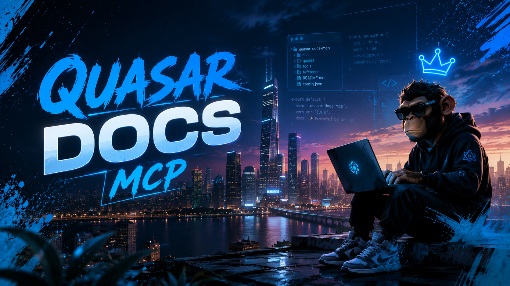

<picture>
  
</picture>

# Quasar Store Docs MCP

An open-source MCP (Model Context Protocol) server that lets AI coding assistants query the public **Quasar Store** documentation in real time.

Fully compatible with **Claude Desktop**, **Claude Code**, **Antigravity** (Google), **OpenCode**, **VS Code** (via Cline, Continue, or Copilot MCP), **Cursor**, and any MCP-compatible client.

By default, the server is pre-configured to work with the live [Quasar Store documentation](https://www.quasar-store.com/docs) — no environment variables or additional setup required.

---

## Table of Contents

- [Tools](#tools)
- [How It Works](#how-it-works)
- [Requirements](#requirements)
- [Installation](#installation)
- [Step-by-Step Setup](#step-by-step-setup)
- [Configuration](#configuration)
  - [Environment Variable](#environment-variable-optional)
  - [CSS Selectors](#css-selectors)
- [Client Integration](#client-integration)
  - [Claude Desktop](#claude-desktop)
  - [Claude Code](#claude-code)
  - [Antigravity (Google)](#antigravity-google)
  - [OpenCode](#opencode)
  - [VS Code](#vs-code-cline-continue-copilot)
  - [Cursor](#cursor)
- [Usage Examples](#usage-examples)
- [Project Structure](#project-structure)
- [Troubleshooting](#troubleshooting)
- [License](#license)

---

## Tools

| Tool         | What it does                                                                 |
| ------------ | ---------------------------------------------------------------------------- |
| `search_docs`| Searches the Quasar Store documentation for articles matching a query term. Returns titles, URLs, and snippets. |
| `read_doc`   | Fetches and returns the full content of a documentation article as formatted Markdown. |

---

## How It Works

The server connects to `https://www.quasar-store.com/docs` and extracts documentation content by scraping the public HTML pages.

The Quasar Store documentation is built with **Next.js** and uses **React Server Components (RSC)**. The server handles this with a three-layer strategy:

1. **Scans the raw HTML** for all `/docs/...` links embedded in the RSC payload, building a complete index of every documentation article (40+ products, each with multiple sub-pages).
2. **Extracts article content** from the RSC data using a best-effort text parser that pulls out headings, paragraphs, and code blocks. If the RSC method fails, it falls back to traditional **cheerio** DOM extraction.
3. **As a last resort**, it returns the article title, meta description, and a list of related documentation links so the AI still receives useful navigation.

The server communicates with your AI client via **stdio** (standard input/output) using the **JSON-RPC** protocol — no HTTP server, no open ports, no network configuration needed.

---

## Requirements

- **Node.js** >= 18
- **npm** (comes with Node.js)

---

## Installation

### Step 1: Clone the repository

```bash
git clone https://github.com/iiamdark/quasar-docs-mcp.git
cd quasar-docs-mcp
```

### Step 2: Install dependencies

```bash
npm install
```

### Step 3: Build the project

```bash
npm run build
```

This compiles the TypeScript source from `src/` into JavaScript, outputting to the `build/` directory.

### Step 4: Make the command globally available (recommended)

```bash
npm link
```

After running `npm link`, the command `quasar-store-docs-mcp` is available globally on your system. This is the **recommended approach** because:

- Your MCP client configs will not contain any file paths to your machine
- You can move the project folder and only need to re-run `npm link`
- The command name is short and consistent across all clients

To verify it worked:

```bash
which quasar-store-docs-mcp   # macOS / Linux
where quasar-store-docs-mcp   # Windows
```

You should see a path like `/usr/local/bin/quasar-store-docs-mcp` or `C:\Users\...\npm\quasar-store-docs-mcp`.

---

## Configuration

The server works **out of the box** with `https://www.quasar-store.com` as the documentation base. You do not need to set any environment variables.

### Environment Variable (optional)

To point the server at a different documentation site:

```bash
# macOS / Linux
export DOCS_BASE_URL="https://your-docs-site.com"

# Windows (Command Prompt)
set DOCS_BASE_URL=https://your-docs-site.com

# Windows (PowerShell)
$env:DOCS_BASE_URL = "https://your-docs-site.com"
```

If not set, the server defaults to `https://www.quasar-store.com`.

### CSS Selectors

If you are using the server with a different documentation site, you may need to adjust the CSS selectors in `src/index.ts`:

```typescript
const SELECTORS = {
  article: "article, .doc-content, .markdown-body, main, .docs-content-page",
  title: "h1",
  navLinks: "nav a, .sidebar a, .toc a, aside a",
};
```

---

## Client Integration

You have two options for referencing the server in your MCP client configuration:

- **Option A (recommended):** Use the global command `quasar-store-docs-mcp` (after running `npm link`)
- **Option B:** Use the full path to `build/index.js` directly

### Claude Desktop

Configuration file: `claude_desktop_config.json`

**Option A — with npm link:**

```json
{
  "mcpServers": {
    "quasar-store-docs": {
      "command": "quasar-store-docs-mcp"
    }
  }
}
```

**Option B — with direct path:**

```json
{
  "mcpServers": {
    "quasar-store-docs": {
      "command": "node",
      "args": ["/full/path/to/quasar-docs-mcp/build/index.js"]
    }
  }
}
```

### Claude Code

```bash
# Option A — with npm link:
claude mcp add quasar-store-docs -- quasar-store-docs-mcp

# Option B — with direct path:
claude mcp add quasar-store-docs -- node /full/path/to/quasar-docs-mcp/build/index.js
```

### Antigravity (Google)

Antigravity reads MCP server configurations from **`~/.gemini/config/mcp_config.json`** (global) or **`.agents/mcp_config.json`** (per-project).

Add the following to the file:

```json
{
  "mcpServers": {
    "quasar-store-docs": {
      "command": "quasar-store-docs-mcp"
    }
  }
}
```

After saving:
1. Restart Antigravity, or
2. Open the agent sidebar → click `...` → `MCP Servers` → `Manage MCP Servers` → the server should appear in the list.

### OpenCode

OpenCode uses a configuration file at **`~/.config/opencode/opencode.json`**. The format is different from other clients:

```jsonc
{
  "$schema": "https://opencode.ai/config.json",
  "mcp": {
    "quasar-store-docs": {
      "type": "local",
      "command": ["quasar-store-docs-mcp"],
      "enabled": true
    }
  }
}
```

> **Differences from other clients:** OpenCode uses `"mcp"` (not `"mcpServers"`). The `command` field is an **array**. Each server requires `"type": "local"` and `"enabled": true`.

### VS Code (Cline, Continue, Copilot)

Configuration file: `settings.json` (User or Workspace)

```json
{
  "mcpServers": {
    "quasar-store-docs": {
      "command": "quasar-store-docs-mcp"
    }
  }
}
```

### Cursor

In Cursor, go to **Settings** → **Features** → **MCP Servers** → **Add new MCP server**:

**Option A — with npm link:**

```
Name: quasar-store-docs
Type: command
Command: quasar-store-docs-mcp
```

**Option B — with direct path:**

```
Name: quasar-store-docs
Type: command
Command: node /full/path/to/quasar-docs-mcp/build/index.js
```

---

## Usage Examples

Once configured, your AI assistant will automatically discover the available tools (`search_docs` and `read_doc`) and use them when relevant.

### Searching for documentation

The AI might call `search_docs` when you ask questions like:

| You ask... | The AI searches for... | Result |
|---|---|---|
| "How do I install Advanced Inventory?" | `search_docs("advanced inventory installation")` | Returns links to relevant installation guides |
| "What are common database errors?" | `search_docs("database errors")` | Returns troubleshooting articles |
| "Explain the housing creator" | `search_docs("housing creator")` | Returns the Housing Creator documentation |
| "How does the smartphone work?" | `search_docs("smartphone")` | Returns Smartphone docs and setup guides |

### Reading a full article

After finding relevant articles, the AI will call `read_doc` with the URL or relative path to get the full content:

```
read_doc("advanced-inventory/installation")
read_doc("https://www.quasar-store.com/docs/smartphone/installation")
read_doc("housing-creator/commands-and-exports")
```

The server returns the content as formatted Markdown, including:
- Article title and description
- Section headings (converted from HTML)
- Paragraphs of explanatory text
- Code blocks
- Lists and tables
- Source attribution

---

## Project Structure

```
quasar-docs-mcp/
│
├── src/
│   └── index.ts              # MCP server implementation
│
├── build/                    # Compiled JavaScript output (generated)
│
├── banner.png                # README banner image
├── package.json              # Dependencies, scripts, and metadata
├── tsconfig.json             # TypeScript compiler configuration
└── README.md                 # This file
```

### Key files explained

| File | Purpose |
|---|---|
| `src/index.ts` | Complete MCP server: initializes the server, registers `search_docs` and `read_doc` tools, implements web scraping with axios + cheerio, and handles RSC payload extraction for Next.js sites |
| `package.json` | Project metadata, dependencies (`@modelcontextprotocol/sdk`, `axios`, `cheerio`, `zod`), build scripts |
| `tsconfig.json` | TypeScript configuration targeting ES2022 with Node16 module resolution |
| `build/index.js` | Compiled output — this is what you reference in your MCP client configs |

---

## Troubleshooting

### "Command not found: quasar-store-docs-mcp"

You have not run `npm link`, or the npm global bin directory is not in your PATH.

- Run `npm link` from the project directory
- Or use the full path to `build/index.js` in your client config

### Server starts but tools return errors

- Check that `https://www.quasar-store.com` is accessible from your network
- Try setting a different `DOCS_BASE_URL` if you are using a custom documentation site

### "Article not found (404)"

- Make sure the URL or path is correct
- Relative paths should be relative to the docs base URL (e.g. `advanced-inventory/installation`)
- You can always use a full URL directly

### Content extraction returns mostly empty

The Quasar Store docs site uses Next.js with client-side rendering for some content. The server tries multiple extraction strategies (RSC → cheerio → related links). If all fail, the AI will still receive the article title, description, and navigation links to related articles.

---

## License

```
MIT License

Copyright (c) 2026 iiamdark

Permission is hereby granted, free of charge, to any person obtaining a copy
of this software and associated documentation files (the "Software"), to deal
in the Software without restriction, including without limitation the rights
to use, copy, modify, merge, publish, distribute, sublicense, and/or sell
copies of the Software, and to permit persons to whom the Software is
furnished to do so, subject to the following conditions:

The above copyright notice and this permission notice shall be included in all
copies or substantial portions of the Software.

THE SOFTWARE IS PROVIDED "AS IS", WITHOUT WARRANTY OF ANY KIND, EXPRESS OR
IMPLIED, INCLUDING BUT NOT LIMITED TO THE WARRANTIES OF MERCHANTABILITY,
FITNESS FOR A PARTICULAR PURPOSE AND NONINFRINGEMENT. IN NO EVENT SHALL THE
AUTHORS OR COPYRIGHT HOLDERS BE LIABLE FOR ANY CLAIM, DAMAGES OR OTHER
LIABILITY, WHETHER IN AN ACTION OF CONTRACT, TORT OR OTHERWISE, ARISING FROM,
OUT OF OR IN CONNECTION WITH THE SOFTWARE OR THE USE OR OTHER DEALINGS IN THE
SOFTWARE.
```

---

*Built with [Model Context Protocol](https://modelcontextprotocol.io) — an open standard for connecting AI assistants with tools and data.*
